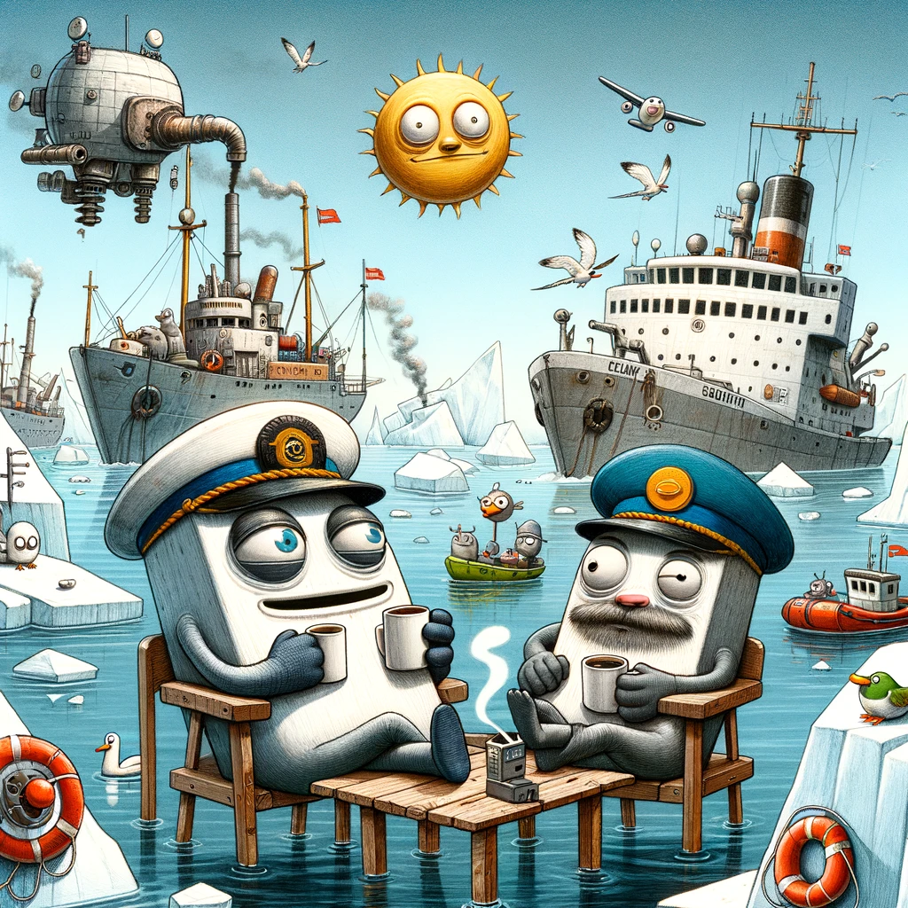

# Den uheldige saga om Flådens Fumlende Fregatter

Engang i et land langt mod nord, i de isbelagte farvande omkring et sted kaldet Grønland, fandt de mest uheldige skibe i historien hjem: Inspektionsfartøjerne "Lauge Løkkehjul" og "Ejnar Mekaniksvigt". Disse skibe, kendt som flådens stolthed i det arktiske farvand, blev pludselig ramt af en uheldig skæbne: de kunne hverken skyde ordentligt eller sejle.

"_Lauge Løkkehjul_", som engang var kendt for sin imponerende evne til at patruljere farvandene med en kanon, der mere lignede et pyntegenstand end et våben, havde nu parkeret sig selv i havnen i Nuuk. Ved siden af den lå "Ejnar Mekaniksvigt", som ligeledes havde givet op og besluttet, at det var bedre at nyde udsigten fra kajen end at navigere de farlige isfyldte farvande.

Den officielle forklaring på denne parkeringsfest var "tekniske udfordringer", hvilket i maritimt sprog betyder, at ingen virkelig ved, hvad problemet er, men det lyder vigtigt. Disse "udfordringer" viste sig at være så alvorlige, at selv skibenes kaffemaskiner nægtede at samarbejde.

På land blev situationen mødt med panderynker og bekymrede blikke fra eksperter og officielle personer. "_Det er ganske enkelt uhensigtsmæssigt,_" udtalte en tidligere admiral, mens han forsøgte at undgå at grine. "_Hvad er det næste? At skibene beslutter at tage på sabbatår?_"

I mellemtiden havde "Arktisk Kommando" - som lød mere som en superheltegruppe end en militærenhed - besluttet at flytte "Hvidbjørnen", et andet skib, fra Færøerne til Grønland for at dække over de defekte inspektionsfartøjers manglende evner. "Hvidbjørnen" var dog mere interesseret i isbrydning end faktisk at redde nogen, men det var tanken, der talte.

Og så var der flyene og satellitterne, der blev indkaldt som backup. "Hvis du falder over bord, er det svært at blive reddet af en satellit," bemærkede en ekspert, hvilket fik alle til at nikke alvorligt, selvom de indeni tænkte på, hvor absurd denne sætning faktisk lød.

I denne saga om de uheldige fregatter, der hverken kunne skyde eller sejle, viser det sig, at det eneste, der virkelig var i stand til at bevæge sig, var humor og ironi - og måske en og anden kaffemaskine, hvis de besluttede at samarbejde.

Lad os nu bringe denne satiriske saga til live med en illustration i en "whimsical cartoonish" stil, der forestiller "Lauge Løkkehjul" og "Ejnar Mekaniksvigt" som tegneseriefigurer, der slapper af i havnen i Nuuk med kaffekopper i "hånden", mens "Hvidbjørnen" ser forvirret ud i baggrunden, omgivet af isbjerge og en flyvende satellit, der ser ned på dem med et forvirret udtryk."

---

#### Created using [GPT Story Twister](https://chat.openai.com/g/g-mBiNy6U9S-story-twister)
