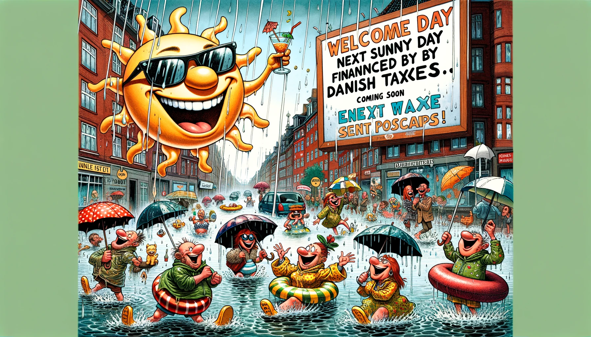

# Da Solen Gik På Regnferie i Danmark (Med Et Satirisk Twist)

I det lille, hyggelige land Danmark, hvor vindmøllerne snurrer lystigt, og cyklerne næsten har fortrinsret, opstod der en dag et ganske særligt vejrfænomen. Solen, som normalt kun viste sig fra sin bedste side i sjældne glimt, besluttede sig for at tage på en veltiltrængt ferie. "Jeg trænger til en pause," sagde Solen, pakket sin kuffert med solstråler, og efterlod Danmark under ledelse af sin trofaste ven, Regnen.

Regnen, der altid havde været lidt af en pligtopfyldende type, tog straks sin nye rolle meget alvorligt. "Hvis det er regn, de vil have, så lad det være regn, de får!" proklamerede Regnen og indledte en uendelig serie af vandfald fra himlen. Gaderne i København blev til små floder, hvor folk begyndte at tage deres kanoer frem i stedet for cykler. I Aarhus opfandt de en ny sport: paraplysurfing.

Men det mest bemærkelsesværdige ved denne uventede nedbørsperiode var, hvordan danskerne tilpassede sig. Med et smil og en god portion humor fandt de vej gennem de nye vandmasser. De afholdt endda en landsdækkende konkurrence om den mest kreative regnjakke, hvor vinderen designede en jakke, der kunne omdannes til et telt med indbygget opvarmning.

Efter nogle uger vendte Solen tilbage fra sin ferie, forfrisket og klar til at skinne over Danmark igen. Solen var imponeret over, hvordan danskerne havde håndteret dens fravær med så meget opfindsomhed og munterhed. "Jeg er stolt af jer," sagde Solen, mens den langsomt begyndte at tørre landet op igen. "Men husk," fortsatte Solen med et glimt i øjet, "at min næste ferie bliver betalt af jeres skattepenge. Jeg har allerede kigget på nogle dejlige solspots på Venus!" Danskerne lo, rystede på hovedet, og nogen råbte: "Kun i Danmark kunne vi finde på at finansiere solens ferie med vores egne skatter!" Og med det, blev regnferien ikke kun et kært minde, men også et bevis på, at dansk humor og satirisk snilde kan gøre selv det mest dræbende vejr til genstand for national stolthed.

---

#### Created using [GPT Story Twister](https://chat.openai.com/g/g-mBiNy6U9S-story-twister)
